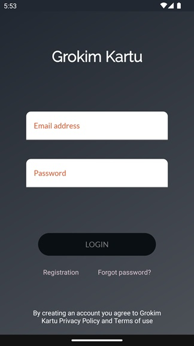
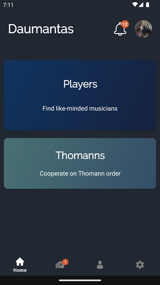
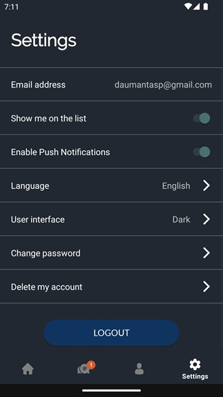

# Grokim Kartu

Social Network Android App for Musicians.

Technologies used:
- MVVM
- Hilt
- Databinding
- Navigation
- Kotlin Coroutines
- Flows
- Retrofit
- Unit Testing

This application is still in development and serves as a learning project.

